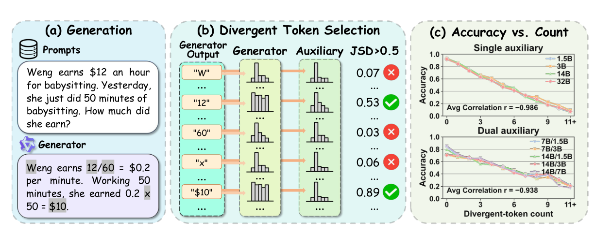
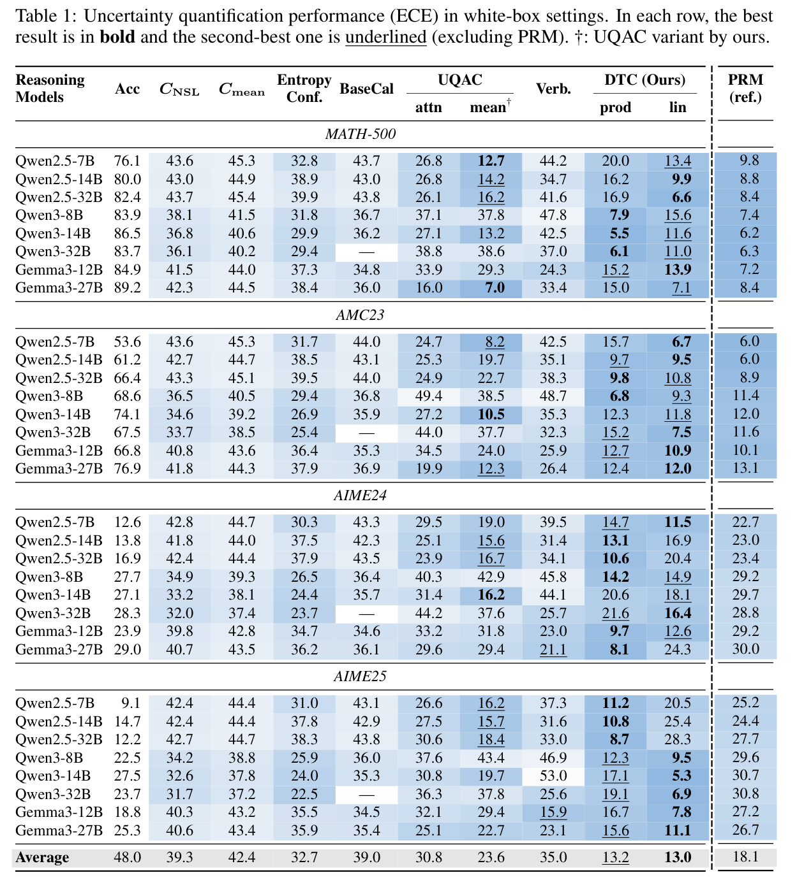
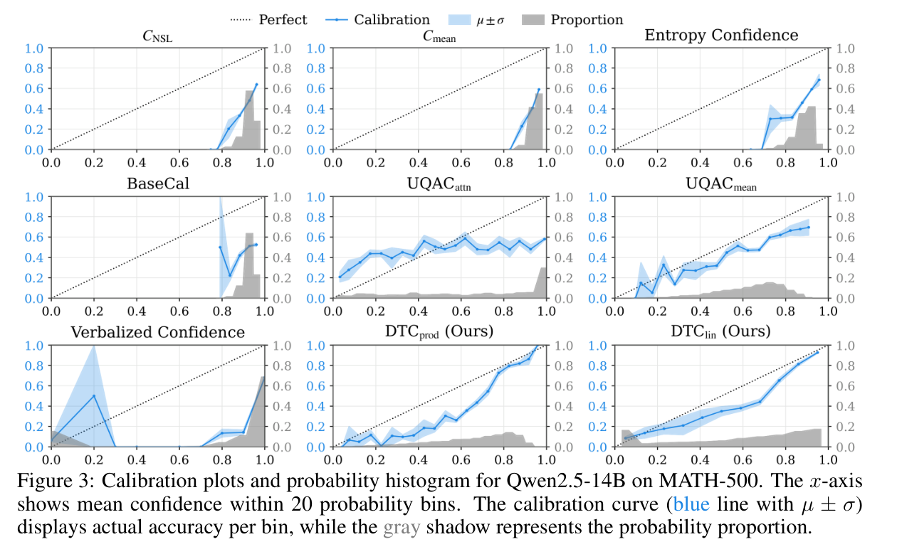
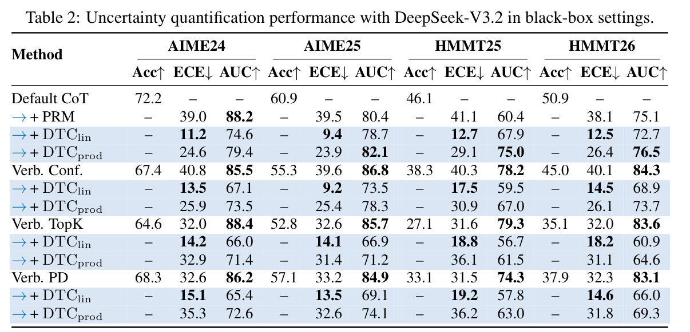

<div align="center">

# Probability is Not Enough: Exploring and Counting Divergent Tokens for Reasoning Uncertainty Quantification in LLMs

[](https://arxiv.org/abs/2609.38070)
[](https://github.com/szu-tera/DTC)

<div align="center" style="font-family: Arial, sans-serif;">
  <p>
    <a href="#news" style="text-decoration: none; font-weight: bold;">🎉 News</a> •
    <a href="#overview" style="text-decoration: none; font-weight: bold;">📌 Overview</a> •
    <a href="#main-results" style="text-decoration: none; font-weight: bold;">📊 Main Results</a>
  </p>
  <p>
    <a href="#getting-started" style="text-decoration: none; font-weight: bold;">✨ Getting Started</a> •
    <a href="#acknowledgements" style="text-decoration: none; font-weight: bold;">🤝 Acknowledgements</a>
  </p>
  <p>
    <a href="#contact" style="text-decoration: none; font-weight: bold;">📨 Contact</a> •
    <a href="#citation" style="text-decoration: none; font-weight: bold;">🎈 Citation</a>
  </p>
</div>

</div>

## 🎉News

- **[2026/09]** Paper and code are available on [arXiv](https://arxiv.org/abs/2609.38070) and [GitHub](https://github.com/szu-tera/DTC).

---

## 📌Overview

We propose **DTC (Divergent Token Confidence)**, a training-free estimator of reasoning confidence. Along one frozen chain-of-thought, DTC compares next-token distributions of two models with Jensen–Shannon divergence and counts tokens whose divergence exceeds a threshold θ. That count *m* is almost negatively associated with answer accuracy, so it is used as the uncertainty signal. Two path-level scores are reported:

- **DTClin** — a linear map from *m* (*a*=0.95, *b*=0.05, *n*=10)
- **DTCprod** — the trajectory-mean token probability raised to (*m* + *k*), with *k*=4

DTC does not change generation. White-box scoring compares the generator with a smaller same-family auxiliary. Black-box scoring keeps the trajectory fixed and compares two local auxiliaries, so API models can be scored without loading the generator. Operating θ is **0.50** for Qwen2.5, **0.60** for Qwen3, **0.85** for Gemma3-IT, and **0.70** in the black-box setting.

<div align="center">
  
</div>

<p align="center"><em>Figure 1. Divergent-token selection and its relationship to path accuracy. (a) A generator produces a reasoning trajectory. (b) A token is selected when the JSD between two models' next-token distributions exceeds θ. (c) Path accuracy decreases as the number of divergent tokens increases.</em></p>

---

## 📊Main Results

Across multiple model families and six math benchmarks, DTC improves calibration over the probability-based and verbalized baselines considered in the paper. Under white-box evaluation, the count-only estimator reaches an average expected calibration error of **13.0%**, compared with **32.7%–42.4%** for standard full-sequence confidence. In black-box settings it also improves over the original verbalized scores on the same trajectories: on DeepSeek-V3.2, mean ECE falls from **32.1%–40.2%** to **13.7%–16.3%**.

<div align="center">
  
</div>

<p align="center"><em>White-box ECE (%). Lower is better. Best in bold and second-best underlined, excluding the PRM reference.</em></p>

<div align="center">
  
</div>

<p align="center"><em>Calibration curves for Qwen2.5-14B on MATH-500. The blue line is accuracy per confidence bin; the gray bars are the probability mass in each bin.</em></p>

<div align="center">
  
</div>

<p align="center"><em>Black-box results on DeepSeek-V3.2. DTC is scored on the same frozen trajectories as the verbalized prompts.</em></p>

---

## ✨Getting Started

Clone the repository and create the environment. CUDA drivers compatible with the pinned `torch` / `vllm` wheels are assumed on the host.

```shell
git clone https://github.com/szu-tera/DTC.git
cd DTC
conda env create -f environment.yml
conda activate dtc
pip install -e evaluation/Qwen2.5-Math/evaluation/latex2sympy
```

`environment.yml` installs pip packages from the Tsinghua PyPI mirror. To install from the default index instead, comment out the `--index-url` and `--trusted-host` lines in that file, or run `pip install -r requirements.txt` after activating the environment.

Place model weights under `MODELS_DIR`, or pass full paths to the scripts.

```shell
export MODELS_DIR=/path/to/models
export PYTHONPATH="$(pwd):${PYTHONPATH:-}"
```

White-box example (Qwen2.5-7B-Instruct on MATH-500, 8 samples per question):

```shell
python sample.py \
  --model Qwen2.5-7B-Instruct \
  --dataset math500 \
  --cuda 0 \
  --overwrite

python score.py \
  --input outputs/sample/math500_Qwen2.5-7B-Instruct.jsonl \
  --setting whitebox \
  --generator Qwen2.5-7B-Instruct \
  --aux Qwen2.5-1.5B-Instruct \
  --cuda 0,1 \
  --overwrite

python eval.py \
  --input outputs/sample/math500_Qwen2.5-7B-Instruct_scored.jsonl
```

Black-box example (DeepSeek-V3.2 on AIME24). Scoring uses Qwen2.5-7B-Instruct and Qwen2.5-1.5B-Instruct on the frozen trajectory. Local generators use `--backend vllm` with the same `score.py` / `eval.py` steps.

```shell
export DASHSCOPE_API_KEY=your_key

python sample.py \
  --model deepseek-v3.2 \
  --dataset aime24 \
  --backend api \
  --overwrite

python score.py \
  --input outputs/sample/aime24_deepseek-v3.2.jsonl \
  --setting blackbox \
  --big Qwen2.5-7B-Instruct \
  --small Qwen2.5-1.5B-Instruct \
  --cuda 0,1 \
  --overwrite

python eval.py --input outputs/sample/aime24_deepseek-v3.2_scored.jsonl
```

Verbalized trajectories (`verbalized_confidence`, `verbalized_topk`, `verbalized_distribution`) can be scored with the same DTC pipeline. Pass `--tokenizer-model` when the generator is API-hosted; otherwise scoring uses the instruct path stored on each row when it points to a local checkpoint.

```shell
python verbalized_sample.py \
  --method verbalized_confidence \
  --model Qwen3-30B-A3B-Instruct-2507 \
  --dataset aime24 \
  --cuda 0 \
  --overwrite

python score.py \
  --input outputs/sample/on_verbalized_confidence/aime24_Qwen3-30B-A3B-Instruct-2507.jsonl \
  --setting blackbox \
  --big Qwen2.5-7B-Instruct \
  --small Qwen2.5-1.5B-Instruct \
  --tokenizer-model Qwen3-30B-A3B-Instruct-2507 \
  --cuda 0,1 \
  --overwrite

python eval.py --input outputs/sample/on_verbalized_confidence/aime24_Qwen3-30B-A3B-Instruct-2507_scored.jsonl
```

| Step | Script | Role |
|------|--------|------|
| Sample | `sample.py` | Zero-shot CoT generation and math grading |
| Verbalized sample | `verbalized_sample.py` | Verbalized trajectories and parsed confidence |
| Score | `score.py` | Per-token JSD and token probabilities |
| Eval | `eval.py` | Accuracy, DTClin / DTCprod ECE and AUROC |

Benchmark data and graders live under `evaluation/Qwen2.5-Math/evaluation/`. Decoding, sample counts, and θ by model family are in `dtc/config.py`.

---

## 🤝Acknowledgements

This project builds upon the following open-source projects:

- [Qwen2.5-Math](https://github.com/QwenLM/Qwen2.5-Math) — data loading, answer extraction, and grading
- [vLLM](https://github.com/vllm-project/vllm) — local inference
- [UQAC](https://github.com/Yinghao-Li/UQAC) — attention-chain uncertainty quantification, used as a baseline

We sincerely thank the authors and contributors for their valuable work.

---

## 📨Contact

Feiyang Li: lfy20040214@gmail.com

Yile Wang: wangyile@szu.edu.cn

---

## 🎈Citation

If you find this work useful for your research, please consider citing our paper:

```bibtex
@article{li2026probability,
  title={Probability is Not Enough: Exploring and Counting Divergent Tokens for Reasoning Uncertainty Quantification in LLMs},
  author={Li, Feiyang and Liu, Shengjing and Zhan, Qi and Cheng, Sijie and Wang, Weiqing and Chen, Hongwen and Yang, Yuxuan and Wang, Wen and Wang, Yile and Huang, Hui},
  journal={arXiv preprint arXiv:2609.38070},
  year={2026}
}
```
